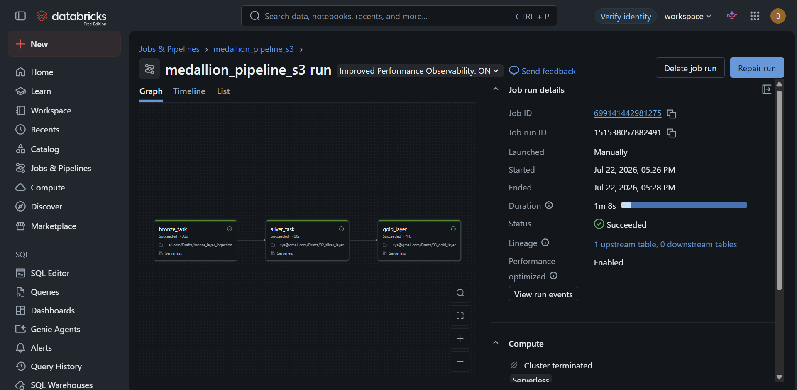

# NYC Taxi Medallion Pipeline — Batch ELT on Databricks + AWS S3

A production-style batch ELT pipeline that ingests raw NYC Yellow Taxi trip data, cleans and validates it, and produces business-ready daily summary metrics — following the Bronze / Silver / Gold Medallion architecture, orchestrated as a dependency-aware job and backed by Amazon S3 with Unity Catalog governance.

## Problem Statement

Raw trip-level data from public sources like the NYC Taxi & Limousine Commission (TLC) is messy — duplicate records, invalid fares, missing passenger counts — and isn't directly usable for reporting or analytics. This pipeline demonstrates a repeatable, production-style pattern for turning that raw data into clean, trustworthy, business-ready tables that answer real questions (e.g. daily trip volume, revenue, average fare).

## Architecture

```
NYC TLC public dataset (parquet)
        │
        ▼
   Amazon S3 (raw/)
        │  Auto Loader (cloudFiles, incremental ingestion, schema evolution)
        ▼
┌─────────────────┐
│   BRONZE LAYER   │  Raw data as-is + ingestion metadata (_ingested_at, _source_file)
│  bronze_taxi_    │
│     trips        │
└────────┬─────────┘
         │
         ▼
┌─────────────────┐
│   SILVER LAYER   │  Deduplicated, null-filtered, invalid-record-filtered
│  silver_taxi_    │
│     trips        │
└────────┬─────────┘
         │
         ▼
┌─────────────────┐
│   GOLD LAYER     │  Daily aggregated business metrics
│ gold_daily_taxi_ │
│     summary       │
└──────────────────┘

Orchestrated end-to-end as a Lakeflow Job — 3-task DAG with explicit dependencies:
bronze_task → silver_task → gold_layer
```

## Tools Used & Why

| Tool | Why |
|---|---|
| **Databricks Auto Loader** | Handles incremental file ingestion automatically, with built-in schema evolution — avoids manually tracking which files have already been processed |
| **Delta Lake** | ACID transactions and reliable `MERGE`/upsert support, which a plain Parquet table doesn't give you |
| **PySpark** | Scales cleanly from this dataset size to much larger volumes without rewriting logic |
| **Amazon S3** | Durable, cloud-native raw storage layer, decoupled from compute |
| **Unity Catalog (Storage Credential + External Location)** | Governs S3 access through a scoped, credential-managed IAM Role instead of static access keys embedded in code |
| **Lakeflow Jobs** | Turns manual notebook runs into a scheduled, monitored, dependency-aware pipeline |

## Storage: S3 via IAM Role (not access keys)

The pipeline was first prototyped against a Databricks-managed Volume as the raw landing zone, while AWS billing verification was pending. The ingestion logic (Auto Loader, schema handling, Delta writes) didn't change at all when moving to S3 — only the source path changed, which validated the pipeline design was storage-agnostic from the start.

Static access keys (`fs.s3a.access.key` / `fs.s3a.secret.key`) were tried first but rejected by serverless compute for security reasons. The pipeline instead uses a **Unity Catalog Storage Credential backed by a self-assuming IAM Role** — the recommended production pattern:
- No long-lived secrets stored in notebooks or job configs
- Access is scoped through a Unity Catalog **External Location**, not broad bucket-level keys
- Credentials are short-lived, issued via `sts:AssumeRole`

## Pipeline Results

| Layer | Row Count | What Happened |
|---|---|---|
| Bronze | 2,964,624 | Raw January 2024 NYC Yellow Taxi trips ingested as-is via Auto Loader from S3 |
| Silver | 2,721,765 | Deduplicated on (VendorID, pickup time, dropoff time); dropped null passenger counts, non-positive fares/distances |
| Gold | 34 | Aggregated to one row per trip date: total trips, total revenue, average trip distance, average fare |

**Data quality note:** the Silver layer removed roughly 8% of Bronze records (~243K rows) as duplicates or invalid entries — showing the raw source data has a meaningful noise rate worth filtering before it reaches reporting tables. The Gold table also surfaced a couple of corrupted-timestamp records (dates far outside January 2024, e.g. 2009 and December 2023) that passed the current Silver filters — a known gap, and a good example of why a data quality pass usually needs a second iteration once you see what the data actually contains. A production version would add an explicit date-range filter to catch this.

## Successful Job Run



Three-task DAG (`bronze_task → silver_task → gold_layer`), Serverless compute, all tasks succeeded.

## Orchestration

The pipeline is split into three independent notebooks — `01_bronze_layer`, `02_silver_layer`, `03_gold_layer` — wired into a single Lakeflow Job with explicit task-level dependencies, rather than one notebook running all three layers sequentially. Each task reads its input fresh from the governed Delta table (`spark.table(...)`) instead of an in-memory variable from a prior cell, so any layer can be retried or re-run independently without re-running the whole pipeline on a partial failure.

## Tradeoffs & Decisions

**Databricks-managed volume first, S3 second.** Rather than block the whole project on AWS billing verification, the pipeline logic was built and validated against Databricks-managed storage first, then re-pointed at S3 by changing only the storage paths.

**IAM Role over access keys.** Access keys are simpler to wire up but are long-lived secrets that must be rotated and protected — and Free Edition serverless compute blocks them outright. The self-assuming IAM Role + Unity Catalog Storage Credential pattern took longer to configure (trust policy, external ID, self-assume permission) but removes secret management from the pipeline entirely.

**Split into a 3-task DAG instead of one notebook.** An earlier version ran all three layers in a single notebook/task for simplicity. This was refactored into three notebooks with explicit `bronze_task → silver_task → gold_layer` dependencies so each layer can be monitored, retried, and scaled independently — the tradeoff was extra setup time for a materially more production-realistic orchestration pattern.

**Skipped SNS/SQS-based file event notifications.** Unity Catalog offered to auto-provision file event resources (SNS/SQS) for faster incremental listing. This was skipped for now since the IAM role lacked `sns:CreateTopic` permission; Auto Loader falls back to directory listing, which is slower and can increase storage listing costs at scale — a known optimization for a future pass.

**Known gap — no explicit date-range filter.** A few corrupted-timestamp records made it into the Gold table (see Data Quality note above). Not fixed in this version so the gap is visible and documented, rather than silently patched.

## How to Run It

1. Clone this repo.
2. Ensure a Unity Catalog Storage Credential and External Location are configured for the target S3 bucket (see Storage section above).
3. Import `01_bronze_layer.py`, `02_silver_layer.py`, `03_gold_layer.py` into a Databricks workspace (Free Edition or higher).
4. Run them individually, or attach all three as dependent tasks in a Lakeflow Job (`bronze_task → silver_task → gold_layer`) for scheduled, orchestrated execution.
5. Tables are created under the `portfolio.raw_data` catalog/schema: `bronze_taxi_trips`, `silver_taxi_trips`, `gold_daily_taxi_summary`.

## Repository Structure

```
├── 01_bronze_layer.py
├── 02_silver_layer.py
├── 03_gold_layer.py
├── screenshots/
│   └── job_run_success.png
└── README.md
```

## Dataset

[NYC Yellow Taxi Trip Records, January 2024](https://www.nyc.gov/site/tlc/about/tlc-trip-record-data.page) — publicly released monthly by the NYC Taxi & Limousine Commission.

## Link to Loom Walkthrough

_[Add Loom link here]_
